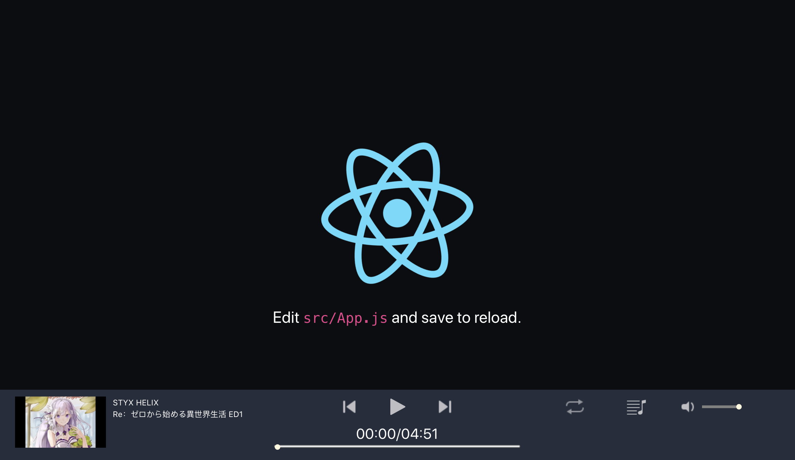

# React audio player
This a React component based on HTML5 `<audio>` tag. It provides basic music player features as well as responsive design. Could be a reference for who want to create their own music player in React.



[Click here for mobile screen shot](readme_img/mobile.png)

This component has been used in project `Teatime music`, visit github repo to see detail:<br>
https://github.com/Dalanke/youtube_audio_API

Live demo can be access here:<br>
https://stayhome-ui.herokuapp.com/

## Project structure

```
.
├── README.md
├── example
├── lib
├── package-lock.json
├── package.json
├── rollup.config.js
└── src
```
* Source code located in `src`
* Example are created by create-react-app, use `cd example && npm start` to start in local host (might need to link the package first)


## Usage

### Import
```JavaScript
import { Player } from '@dalanke/react-audio-player';

...
// in render()/return()
<Player
  playlist={this.state.playlist}
  shufflePlaylist={this.shufflePlaylist}
  removeFromPlaylist={this.removeFromPlaylist}
  hide={this.state.hidePlayer}
/>
```

### Component props

* `playlist`: the playlist pass into player. Playlist should be a object contains `name`, `description` and `musics`. `musics` is an array store muisc information, `src` will be passed into `<audio src="">`. See example playlist below:
  ``` javascript
  const testPlaylist = {
  name: 'Temp Playlist',
  description: '',
  musics: [
    {
      src: 'https://stayhome-api.herokuapp.com/stream?id=HdQCWXh3XXU',
      title: 'STYX HELIX ',
      author: 'Re：ゼロから始める異世界生活 ED1',
      thumbnail: 'https://i.ytimg.com/vi/HdQCWXh3XXU/maxresdefault.jpg',
    },
    {
      src: 'https://stayhome-api.herokuapp.com/stream?id=E8S2IHiuWZA',
      title: 'Kizuna Music キズナミュージック♪ [Piano+Sheet]',
      author: 'Poppin Party',
      thumbnail: '',
    },
    ],
  }
  ```

* `shufflePlaylist`: the function shuffle playlist(shuffle `musics` array), example code:
  ```javascript
  shufflePlaylist = (callback) => {
    const copyList = [...this.state.playlist.musics];
    for (let i = copyList.length - 1; i > 0; i--) {
      const j = Math.floor(Math.random() * (i + 1));
      [copyList[i], copyList[j]] = [copyList[j], copyList[i]];
    }

    // we need reset the current index after shuffle, pass the call back in here
    this.setState({ playlist: { ...this.state.playlist, musics: copyList } }, callback);
  }
  ```

* `removeFromPlaylist`: remove a song from playlist, used in playlist button, example code: 
  ```javascript
  removeFromPlaylist = (index) => {
    const copyList = [...this.state.playlist.musics];
    copyList.splice(index, 1);
    this.setState({ playlist: { ...this.state.playlist, musics: copyList } });
  }
  ```

* `hide`: boolean, hide the player or not

## Development

* This component is styled with `react-bootstrap`
* Each botton are separated into child component.
* The `Player` component create a ref to `<audio>` tag, to access the `<audio>` element, use `this.audio.current`, see MDN docs for more info about `<audio>`:<br>
https://developer.mozilla.org/en-US/docs/Web/HTML/Element/audio
